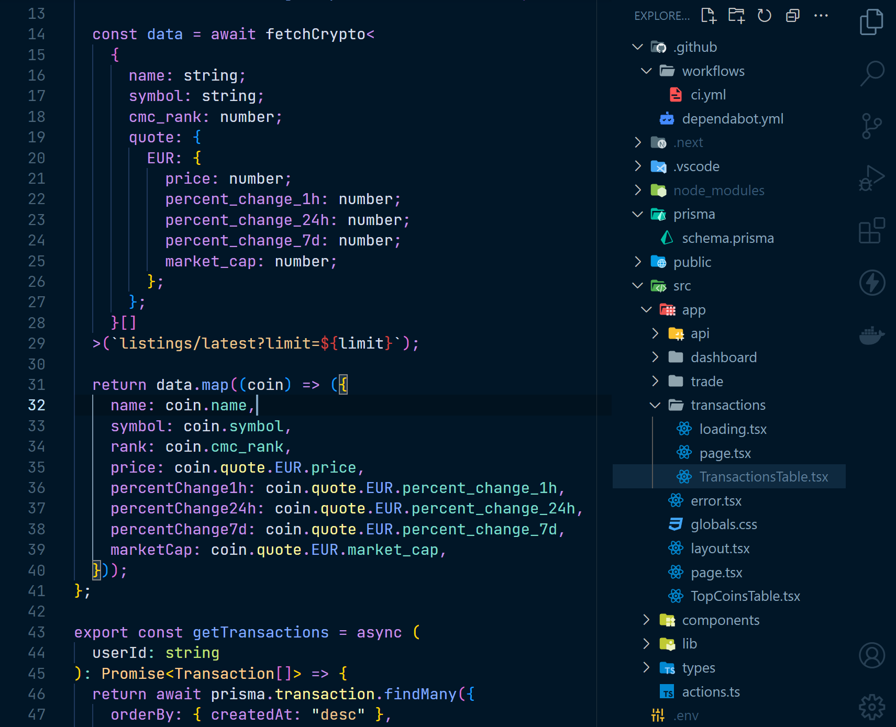

# VSCode settings

Settings for a minimal VSCode setup.

## Font

[JetBrains Mono](https://www.jetbrains.com/lp/mono/)

## Settings

[settings.json](https://github.com/MaximilianHagelstam/vscode-settings/blob/main/settings.json)

## Snippets

[global-snippets.json](https://github.com/MaximilianHagelstam/vscode-settings/blob/main/global-snippets.json)

## Extensions

- Error Lens
- Material Icon Theme
- Night Owl
- Code Spell Checker
- Docker
- ESLint
- Go
- IntelliCode
- Prettier
- Pretty TypeScript Errors
- Tailwind CSS IntelliSense
- Template String Converter
- Thunder Client
- YAML
